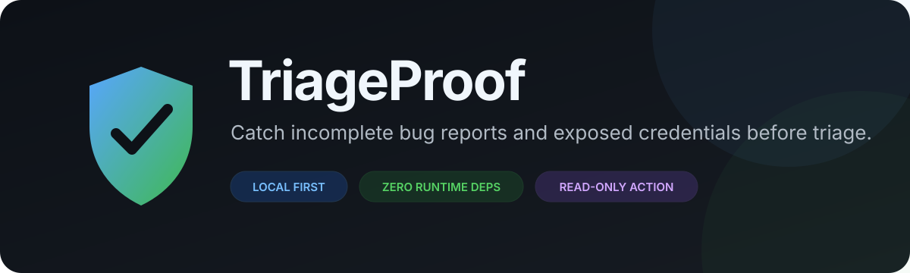
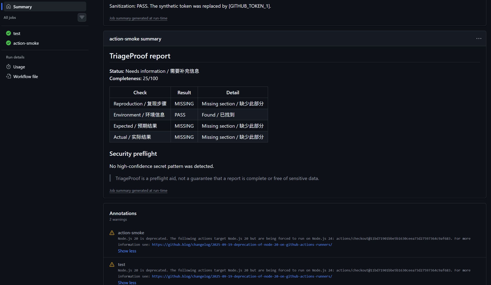
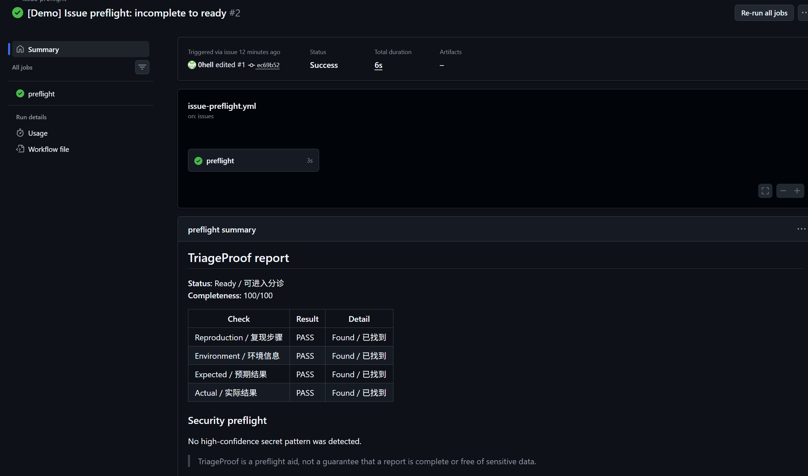
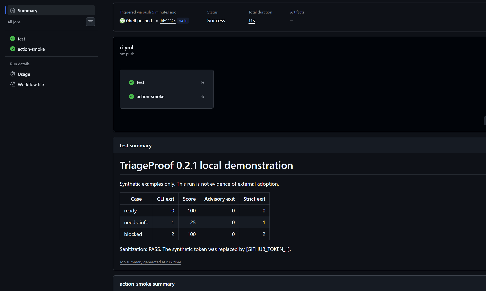

<p align="center">
  
</p>

<p align="center">
  <a href="README.md">English</a> · <a href="README.zh-CN.md">简体中文</a>
</p>

<p align="center">
  <a href="https://github.com/0hell/triageproof/actions/workflows/ci.yml"></a>
  <a href="https://github.com/0hell/triageproof/tags"></a>
  <a href="LICENSE"></a>
  <a href="https://nodejs.org/"></a>
</p>

TriageProof 在进入分诊流程前检查公开错误报告：提示缺失的复现证据，并检测少量高置信度凭据模式，同时不把 Issue 内容发送给外部服务。

- **报告更可用：**检查复现步骤、环境信息、预期结果和实际结果。
- **默认本地：**规则确定、零运行时依赖、无 API 调用、无遥测。
- **自动化更安全：**GitHub Action 只读运行，不评论、不加标签、不关闭或编辑 Issue。

> **早期 MVP：**TriageProof 能降低无效分诊和意外泄露风险，但不能保证报告完整或完全没有敏感信息。

## 真实演示：不完整 Issue → Action 检测 → 补全通过

我们在 **2026-09-05** 创建并编辑了[测试 Issue #1](https://github.com/0hell/triageproof/issues/1)，
实际触发了两次 GitHub Actions。正文是维护者专门准备的模拟样例。

### 1. 提交不完整 Issue

[初始正文](examples/live-demo/before.md)故意只填写环境信息：

```markdown
# Demonstration report

This is a maintainer-created synthetic example for the README, not a product defect.
The first version intentionally omits reproduction steps and expected/actual behavior.

## Environment

Windows 11, Node.js 22.12.0 (example environment).
```

### 2. 查看缺失信息报告

打开[第一次 Action 运行](https://github.com/0hell/triageproof/actions/runs/33952775281)，
在 **Summary** 页面向下找到 **TriageProof report**（如有提示，请先登录 GitHub）。
初始正文对应的检测结果：

```text
TriageProof report

Status: Needs information / 需要补充信息
Completeness: 25/100

Reproduction / 复现步骤   MISSING
Environment / 环境信息   PASS
Expected / 预期结果      MISSING
Actual / 实际结果        MISSING

Security preflight: no high-confidence pattern detected
```

报告只包含受控的检查结果和位置，不回显原始 Issue 正文或检测到的凭据值。

**检测报告截图（CI 自测）：**下图来自 [CI 运行](https://github.com/0hell/triageproof/actions/runs/33953191758)
中的 `action-smoke`，使用模拟事件展示同样的 25/100 缺失信息结果。
第一次真实 Issue 运行请查看上方链接。



### 3. 补全同一个 Issue，再次检测通过

编辑同一个 Issue，补上复现步骤、预期结果和实际结果，自动触发第二次检测。
查看[补全后的正文](examples/live-demo/after.md)和[第二次 Action 运行](https://github.com/0hell/triageproof/actions/runs/33952930498)。

| 检查项 | 修改前 | 修改后 |
| --- | --- | --- |
| 复现步骤 | MISSING | PASS |
| 环境信息 | PASS | PASS |
| 预期结果 | MISSING | PASS |
| 实际结果 | MISSING | PASS |
| 完整度 | **25/100** | **100/100** |
| 报告状态 | `needs-info`（需要补充信息） | **`ready`（可进入分诊）** |
| 疑似凭据 | 0 | 0 |

两次真实运行均使用 `advisory` 模式并成功完成。**工作流绿色表示 Action 执行成功，
Issue 是否通过要看报告状态。** 上述结果也已使用同一版本的 Action 入口回放保存的正文核对。
这是实际集成演示，不代表外部用户采用。

**真实 Issue 补全结果：**下图来自第二次运行，显示 `edited #1`、`preflight` 任务、
`Ready`、100/100 和四项 `PASS`。



<details>
<summary>展开 CI 自测总览：命令行、advisory、strict 与脱敏</summary>

下图展示同一次 [CI 运行](https://github.com/0hell/triageproof/actions/runs/33953191758)
的 `test` 和 `action-smoke` 任务，以及模拟 `ready`、`needs-info`、`blocked` 场景的验证结果。



</details>

[截图来源与复跑指南](docs/LIVE_DEMO.md)列出了三张原图、各自对应的运行记录和复跑步骤。

## 一键复制工作流

点击下面代码块右上角的复制按钮，保存为仓库中的 `.github/workflows/issue-preflight.yml`。
也可以直接使用[完整工作流文件](examples/issue-preflight.yml)。

```yaml
name: Issue preflight

on:
  issues:
    types: [opened, edited, reopened]

permissions: {}

concurrency:
  group: triageproof-issue-${{ github.event.issue.number }}
  cancel-in-progress: true

jobs:
  preflight:
    runs-on: ubuntu-latest
    steps:
      - name: Check issue
        uses: 0hell/triageproof@v0
        with:
          mode: advisory
```

将文件提交到仓库的**默认分支**后，新建或编辑一个 Issue，
前往 **Actions → Issue preflight → Summary → TriageProof report** 查看报告。

建议试用阶段使用 `advisory`：只生成报告，不阻断工作流。改成 `strict` 后，信息缺失会返回退出码 `1`，疑似包含敏感凭据会返回 `2`。如果你的供应链策略要求不可变 Action，请将 `v0` 换成完整提交 SHA。

## 本地运行

需要 Node.js 20 或更高版本，不需要安装运行时依赖。

```powershell
git clone https://github.com/0hell/triageproof.git
cd triageproof
node bin/triageproof.js check examples/complete-issue.md
```

执行 `npm run demo` 可以离线体验完整流程：脚本会使用模拟样例验证命令行、
脱敏和 Action 的两种模式，并在新的 `demo-output/run-*/` 目录生成可阅读的报告。
先打开其中的 `SUMMARY.md`。详见[本地演示指南](docs/LOCAL_DEMO.md)。

检查自己的 Markdown、读取标准输入、输出 JSON 或生成清理后的文本：

```powershell
node bin/triageproof.js check issue.md
Get-Content -Raw issue.md | node bin/triageproof.js check -
node bin/triageproof.js check issue.md --format json
node bin/triageproof.js sanitize issue.md > safe-issue.md
```

| 退出码 | 含义 |
| ---: | --- |
| `0` | 可以进入分诊 |
| `1` | 需要补充信息 |
| `2` | 检测到疑似敏感凭据 |
| `64` | 命令、输入、事件或 Action 模式无效 |

## 当前检查内容

| 检查项 | 当前行为 |
| --- | --- |
| 复现证据 | 支持英文和简体中文 Markdown 标题 |
| 环境信息 | 要求存在非占位内容 |
| 预期与实际结果 | 分开检查，明确指出缺口 |
| 凭据预检 | 对部分密钥、Token、显式赋值和私钥块使用少量高置信规则 |
| 安全报告 | 输出 Markdown 或 JSON，不回显检测值 |

## 安全设计

- 将 Issue 和 PR 文本作为不可信数据处理，永不执行其中的内容。
- 核心功能不联网，也不上传报告正文。
- Action 不请求仓库权限，不执行写操作。
- 限制输入、事件和发现数量，避免输出失控。
- 敏感凭据检测刻意保持小范围；完整仓库扫描仍应使用专用工具。

详细威胁边界和漏洞报告方式见 [SECURITY.md](SECURITY.md)。

## 加入试用

我们正在寻找少量接收公开错误报告的开源仓库自愿试用。接入约需五分钟，只记录经维护者同意公开的汇总反馈，绝不保存私有 Issue 正文或密钥值。

[申请试用或提交反馈](https://github.com/0hell/triageproof/issues/new?template=pilot-feedback.yml) · [阅读试用指南](PILOT.md)

## 当前状态与路线图

**v0.2 — Pilot Ready** 增加可重复运行的本地演示、损坏事件的安全错误提示，
以及实际加载 Action 入口的 CI 验证。版本号统一来自项目配置。
AI 集成、自动修改 Issue、广泛密钥扫描和复杂配置系统仍不在范围内。

CI 使用模拟 Issue 数据。[测试 Issue #1](https://github.com/0hell/triageproof/issues/1)
还使用模拟正文验证了真实的 `opened` 和 `edited` 事件，详见[真实演示记录](docs/LIVE_DEMO.md)。
这些验证不代表外部采用；维护者反馈单独记录。

参见 [v0.2 计划](docs/V0.2_PLAN.md)、[路线图](ROADMAP.md)和[更新日志](CHANGELOG.md)。

## 参与贡献

欢迎提交错误报告、安全测试样例、翻译和试用反馈。请先阅读 [CONTRIBUTING.md](CONTRIBUTING.md)和[行为准则](CODE_OF_CONDUCT.md)。

本项目使用 [MIT License](LICENSE)。
